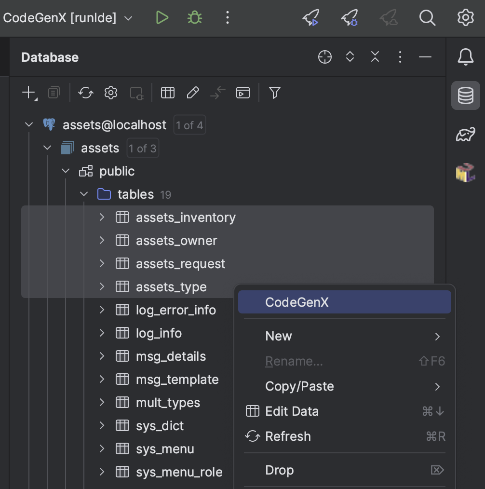

CodeGenX
---
> An IDEA plugin for code model generation of database tables

#### Features
- Generate code types: Entity, Repository
- Support framework: [*Jimmer*](https://github.com/babyfish-ct/jimmer)
- Support languages: Java, Kotlin
- Supports mixed prefix and suffix naming strategies
- Automatically add excluded columns from super class
- Custom mapping and persistence of database types and jvm types
- Preview the results to be generated
- Detailed log output

#### Usage

#### Screenshot
- Generator

- RegisteredType

- Install Plugin

