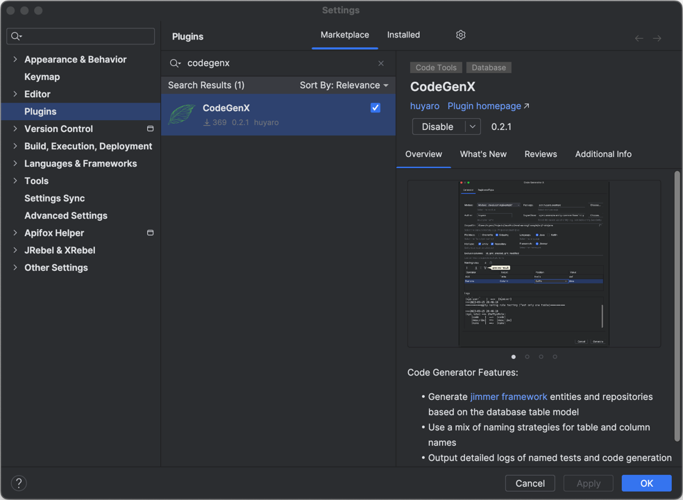

CodeGenX
---
> An IDEA plugin for code model generation of database tables

#### Features
- Generate code types: Entity, Repository, Input
- Support framework: [*Jimmer*](https://github.com/babyfish-ct/jimmer)
- Support languages: Java, Kotlin

#### Usage

#### Screenshot
- Generator

- RegisteredType

- IDEA Plugin

