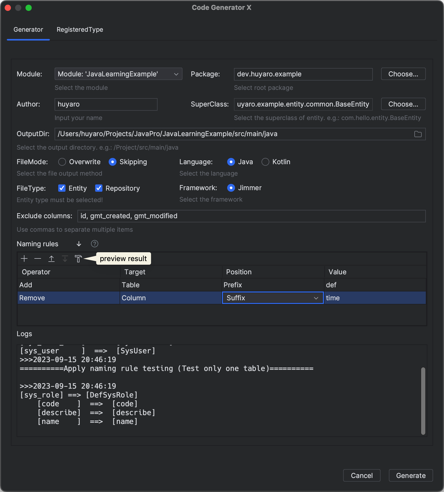

CodeGenX
---
> Code generation plug-in based on database table

#### Features
- generate code for entity and repository
- support framework: jimmer
- support language: java, kotlin

#### Todo
- [ ] generate code for repository
- [ ] support for mybatis

#### Screenshot
- Generator

- RegisteredType

- IDEA Plugin
